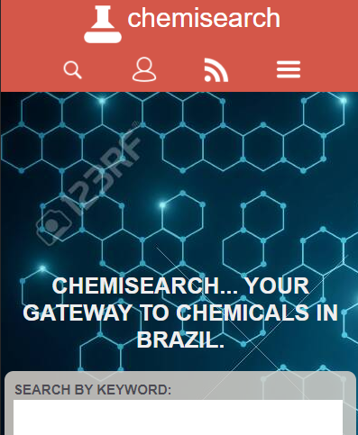

# Capstone Project

This is a

# What it does

This page shows a

## Built with

HTML and CSS

## Live Demo

[Click for live webpage]()

## Getting Started

You will be redirected to

## Author

Murilo Roque Paiva da Silva

Github: @MuriloRoque
Twitter: @MuriloRoquePai1
Linkedin: https://www.linkedin.com/in/murilo-roque-b1268741/

## 🤝 Contributing

Contributions, issues and feature requests are welcome! Start by:

- Forking the project
- Cloning the project to your local machine
- `cd` into the project directory
- Run `git checkout -b your-branch-name`
- Make your contributions
- Push your branch up to your forked repository
- Open a Pull Request with a detailed description to the development branch of the original project for a review

## Pending and proposed features

- Working buttons and links
- Design improvments
- Improved responsiveness
